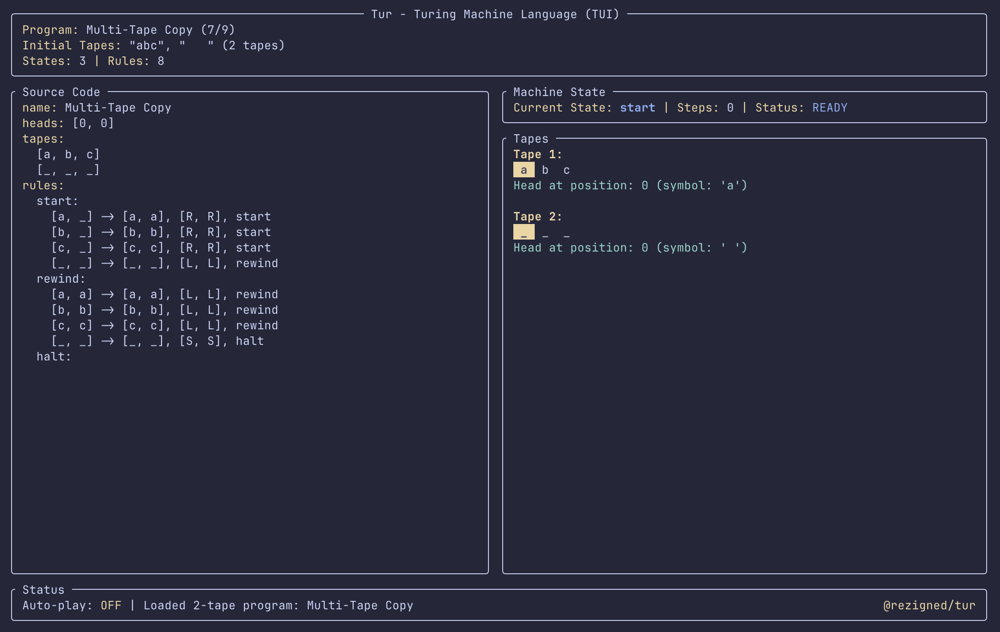

<h1>Tur Analyser</h1>

<p>This project is an extension of the pre-existing <a href="https://github.com/rezigned/tur">Tur project</a>, modified to include an additional section for the runtime analysis of designed Turing machines. This analysis is split across two methods:<ul>
<li>Genetic Algorithm-based analysis</li>
<li>Grammatical Fuzzing-based analysis</li></ul>
Modals are included which explain in greater detail how these operate. A summary is included below to briefly explain these methods and their usage.
</p>

<h3>Genetic Algorithm-based Analysis</h3>

<p>Uses a classic genetic algorithm based approach; this approach performs gradient descent towards the optimally slow input for each input length using mutation and single-point crossover. This iteratively converges on a maxima, but is likely to miss the global maxima in high-dimensional search space. The input alphabet is assumed from the symbols present in transitions. This approach is entirely automatic, and requires no additional user input.</p>

<h3>Grammatical Fuzzing-based Analysis</h3>

<p>Uses a regular expression-like syntax to allow for guided generation of optimal inputs. Distinct from typical fuzzing approaches, the syntax allows for specification of variable-bounded ranges (i.e. (a){x * 2}(b){x} generating a sequence with two times more "a" than "b"). This significantly increases the expressiveness of the language, allowing it to represent many expressions far more complex than standard fuzzing would permit, necessary for the increased complexity associated with Turing machines.</p>

<p>As this project is built on Tur, its own description is still relevant to the usage of this. It is included below. Note that this project is only built for the web release of Tur, and is not integrated into the CLI/TUI versions of this project.</p>

<h1>Tur - Turing Machine Language</h1>

[](https://crates.io/crates/tur) [](https://docs.rs/tur) [](https://github.com/rezigned/tur/actions/workflows/ci.yml)

<p align="center">
  
</p>

**Tur** is a language for defining and executing Turing machines, complete with parser, interpreter, and multi-platform visualization tools. It supports both single-tape and multi-tape configurations.

<table>
  <thead>
    <tr>
      <th width="500px">Web</th>
      <th width="500px">TUI</th>
    </tr>
  </thead>
  <tbody>
    <tr>
      <td>
        <a href="https://rezigned.com/tur"></a>
      </td>
      <td>
        
      </td>
    </tr>
  </tbody>
</table>

## Language Overview

Tur (`.tur` files) provides a clean, readable syntax for defining both single-tape and multi-tape Turing machines. The language includes:

- **Declarative syntax** for states, transitions, and tape configurations
- **Multi-tape support** with synchronized head movements
- **Built-in validation** and static analysis
- **Cross-platform execution** via CLI, TUI, and web interfaces

## Syntax Examples

### Single-Tape Turing Machine

```tur
name: Binary Counter
tape: 1, 0, 1, 1
rules:
  start:
    0 -> 0, R, start
    1 -> 1, R, start
    _ -> _, L, inc   # Reached end, go back to start incrementing
  inc:
    0 -> 1, S, done  # 0 becomes 1, no carry needed
    1 -> 0, L, inc   # 1 becomes 0, carry to next position
    _ -> 1, S, done  # Reached beginning with carry, add new 1
  done:
```

### Multi-Tape Turing Machine

```tur
name: Copy Tape
tapes:
  [a, b, c]
  [_, _, _]
rules:
  copy:
    [a, _] -> [a, a], [R, R], copy
    [b, _] -> [b, b], [R, R], copy
    [c, _] -> [c, c], [R, R], copy
    [_, _] -> [_, _], [S, S], done
  done:
```

## Language Specification

### Program Structure

Every `.tur` program consists of:

```tur
name: Program Name

# Single-tape configuration
tape: symbol1, symbol2, symbol3
head: 0  # optional, defaults to 0

# OR multi-tape configuration
tapes:
  [tape1_symbol1, tape1_symbol2]
  [tape2_symbol1, tape2_symbol2]
heads: [0, 0]  # optional, defaults to [0, 0, ...]

# Optional blank symbol (defaults to ' ')
blank: ' '

# Transition rules
rules:
  state_a:
    input -> output, direction, next_state
    # ... more transitions
  state_b:
    # ... transitions
```

> [!NOTE]
> The first state defined in the `rules:` section is automatically considered the start state. In the examples above, `state_a` is the initial state because it appears first.

### Transition Rules

**Single-tape format:**
```tur
current_symbol -> write_symbol, direction, next_state
```

**Multi-tape format:**
```tur
[sym1, sym2, sym3] -> [write1, write2, write3], [dir1, dir2, dir3], next_state
```

### Directions

- `L` or `<` - Move left
- `R` or `>` - Move right
- `S` or `-` - Stay (no movement)

### Comments

```tur
# This is a comment
state:
  a -> b, R, next  # Inline comment
```

### Special Symbols

- The underscore (`_`) is a special symbol used to represent a blank character in program definitions.
- Any other character or unicode string can be used as tape symbols.
- The blank symbol can be customized using the `blank:` directive in the program.

## Platforms

### Command Line Interface (CLI)

```bash
# Run a program
cargo run -p tur-cli -- examples/binary-addition.tur

# Pipe input to a program
echo '$011' | cargo run -p tur-cli -- examples/binary-addition.tur

# Chaining programs with pipes
echo '$011' | cargo run -p tur-cli -- examples/binary-addition.tur | cargo run -p tur-cli -- examples/binary-addition.tur
```

### Terminal User Interface (TUI)

```bash
# Interactive TUI with program selection
cargo run --package tur-tui
```

## Documentation

- **API Documentation**: [docs.rs/tur](https://docs.rs/tur)
- **Repository**: [github.com/rezigned/tur](https://github.com/rezigned/tur)
- **Examples**: See the `examples/` directory for sample `.tur` programs

## License

- MIT License ([LICENSE](LICENSE))
